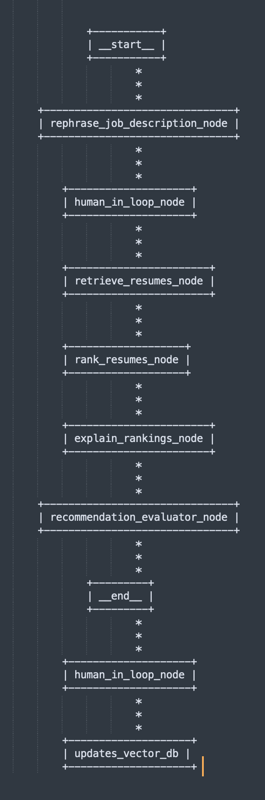

# Resume Matcher with LangGraph

## Goal
This project is an **agentic system** built using **LangGraph** that matches job descriptions (JDs) to the most relevant resumes. It automates the end-to-end pipeline including rephrasing the JD, retrieving resumes, ranking them, explaining the rankings, and evaluating the recommendation quality.

## Disclaimer
For testing purposes, only 5 resumes were ingested, and the top 3 matches were retrieved.

## Input
1. Job Description : Examples of Job Description can be found in example_jd_text.py
2. User Query 

## Features

**Data Ingestion** : 

    - Data Cleaning

        a. Extracted text from Raw Resumes using python docx2txt

        b. Extracted relevant features from parsed text using LLM and stored it in formatted resumes. 
        
        Key feature "overall_summary" is a comprehensive generated summary (up to 5000 words) that captures all important information from the resume. 

    - Uploading Data

        a. Embedded formatted resumes and stored them in a vector DB using cosine similarity for accurate retrieval.

        b. Added a "status" metadata field (default: 'Available') to track candidate availability. 
        
        After generating recommendations, this field can be updated ('Unavailable') based on human input, allowing future recommendations to exclude unavailable candidates.
        
        c. page_content : contains overall_summary; metadata : contains role, resume_id(resume path), total_experience_in_years, status

    *[Files to be referred : clients/openai_resume_parser, clients/qdrant.py]*

    
    

---

**Graph Workflow** : 

- **Rephrases** 

    `Job Description` along with `User Query` are combined into a single rephrased requirement for better clarity and retrieval optimization.

    *[Files to be referred : nodes/rephrase_job_description_node.py]*

- **Retrieves Resumes** 

    Cosine Similarity search algorithm helps retrieve top-k resumes.

    *[Files to be referred : nodes/retrieve_resumes_node.py]*

- **Ranks resumes** 

    Uses cross-encoders to re-rank the retrieved resumes. This ensures more accurate and context-aware candidate matching.

    *[Files to be referred : nodes/rank_resumes_node.py]*

- **Explains** 

    Why resumes were ranked that way using an LLM. Provides key matching skills and justification. Also ensures guardrails against toxic language.

    *[Files to be referred : nodes/explain_rankings_node.py]*

- **Evaluates** 

    Evaluates the quality of the final recommendations using RAGAS metrics like *Faithfulness* and *AnswerRelevancy*.

    *[Files to be referred : nodes/recommendation_evaluator_node.py]*

## Sample Output
File to be referred : results.md

## Graph Workflow Diagram

  

## To Do (In Progress)

1.	Implement Human-in-the-Loop:

    I plan to leverage LangGraph interrupts to incorporate human feedback, such as:

    •	Prompting the user to confirm if they are satisfied with the rephrased query, allowing them to revise it if needed.

        •	Asking the user to update candidate statuses, for example marking candidates as unavailable if applicable.

2.	Implement Guardrails for PII:

    To prevent storing sensitive data like gender, email, and phone numbers in the vector database. This might also help in avoiding bias.

    I experimented with DetectPII from Guardrail-AI but it removed relevant details like total years of experience. I am exploring alternatives like Nvidia NeMo to more accurately filter out PII without losing key information.

3. Optimise for Scalability & Performance

4. Implement automated feedback loops

5. Bias Mitigation
